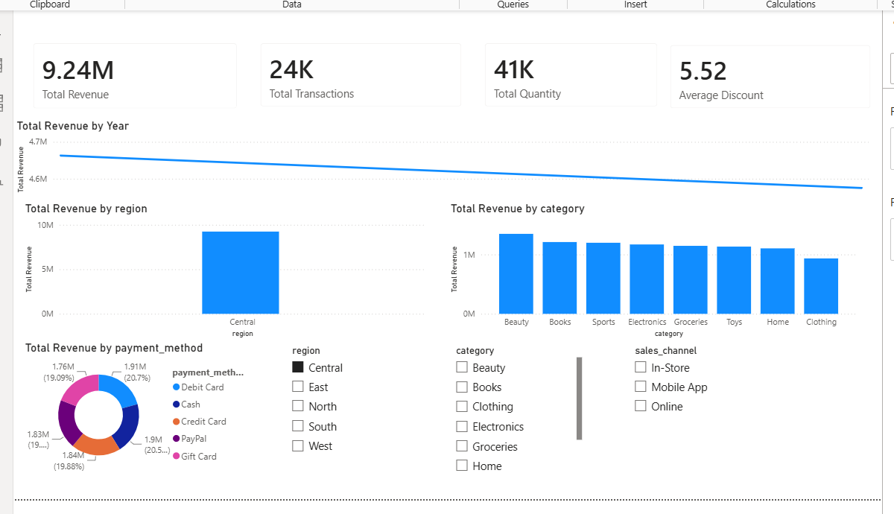

# 📊 Pricing & Discount Analysis Dashboard

## 📌 Project Overview

This project analyzes a retail sales dataset containing **120,000 transactions** to identify revenue trends, customer purchasing behavior, regional performance, and the impact of discounts on sales.

The dashboard was built using **Power BI**, while **Python** was used for data cleaning and exploratory data analysis (EDA), and **SQL** was used for business query analysis.

---

## 🎯 Business Objectives

- Analyze overall business performance.
- Identify top-performing categories and brands.
- Compare regional revenue.
- Understand customer payment preferences.
- Track revenue trends over time.
- Build an interactive dashboard for business decision-making.

---

## 🛠️ Tools & Technologies

- Python
- Pandas
- NumPy
- Matplotlib
- SQL
- Power BI
- DAX

---

## 📂 Dataset Information

- **Rows:** 120,000
- **Columns:** 17

Main Columns:
- Transaction Date
- Product Name
- Category
- Brand
- Region
- Quantity
- Unit Price
- Discount %
- Sales Amount
- Payment Method
- Sales Channel

---

## 📊 Dashboard Features

### KPI Cards
- Total Revenue
- Total Transactions
- Total Quantity Sold
- Average Discount

### Visualizations
- Revenue Trend Over Time
- Revenue by Category
- Revenue by Region
- Revenue by Payment Method
- Top 10 Brands by Revenue

### Interactive Filters
- Region
- Category
- Sales Channel

---

## 🔍 Key Business Insights

- Identified the highest revenue-generating product categories.
- Compared revenue performance across different regions.
- Analyzed customer payment method preferences.
- Identified the top-performing brands.
- Built an interactive dashboard for dynamic business analysis.

---

## 📸 Dashboard Preview

> 

---

## 🚀 Skills Demonstrated

- Data Cleaning
- Exploratory Data Analysis (EDA)
- SQL Business Queries
- DAX Measures
- Dashboard Design
- Data Visualization
- Business Insight Generation

---

## 📁 Project Structure

```
Pricing-Discount-Analysis/
│
├── Dataset/
├── Python_EDA.ipynb
├── SQL_Queries.sql
├── Pricing_Discount_Dashboard.pbix
├── Dashboard.png
└── README.md
```

---

## ⭐ Project Outcome

This project demonstrates an end-to-end Data Analytics workflow—from data cleaning and SQL analysis to building an interactive Power BI dashboard that supports business decision-making.
